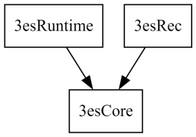

# Library organisation {#docorganisation}

3rd Eye Scene is at its core a client/server application. A 3es server may be embedded into any application which needs to expose 3D data and cannot easily otherwise do so. A 3es client application can connect to a 3es server to either view or record (or both) the data exposed by the server code.

The 3rd Eye Scene code base of three key components:

- C# core code (client and server)
- C++ core code (client and server)
- C++ viewer client code
- Unity viewer client code (C#)

The C# and C++ code each implement the same core components to support the 3rd Eye Scene client/server module. This includes message structures to support the [3es protocol](#docprotocol), network transport and connection management and core shape definitions and utilities. The C# code also includes a command line recording client application and a library to bridge between the core C# code and Unity. This library also supports the plugin extension model. Finally, the Unity code provides a client viewer application for viewing 3es connections and recorded files.

## C# Core Libraries

The C# library organisation is illustrated below.

<!--

-->

### 3esCore (C#)

The core library provides classes to support writing a 3rd Eye Scene client and server applications. It includes:

- Network message structures to support the [protocol](#docprotocol).
- Defines the interface for a server connection.
- Implements TCP server and connection management.
- IO classes to help package, send and receive network messages and calculate CRC values.
- Support classes for sending shape and other messages to connected clients.
- Compression classes, based on .Net `System.IO.Compression`. The standard classes are not supported within Unity.
- Some maths utility classes (vector, matrix, etc).
- Shape definitions for the core 3rd Eye Scene shapes.
- Support utilities including packet collation utilities and a thread safe queue.

This library is required by both client and server applications.

An application can support a 3es server and remotely render data to a connected client by the following steps:

- Instantiate a TCP Server class
- Periodically update and maintain the server connections.
- Create shapes and send updates as required.

Note that the C# is slightly more difficult integrate and maintain than the C++ use case. Where the C++ server commands can easily be compiled out through the use of the C++ preprocessor, C# code must be more explicitly guarded and removed due to the limitations of the C# preprocessor.

### 3esRuntime (C#)

The 3esRuntime library is a small extension to the `3esCore` library to support bridging between pure C# code and the Unity viewer client. It serves to:

- Provide utility functions to convert between `3esCore` maths classes and Unity maths classes.
- Define a common message handling protocol and base class.

While this code could be wrapped up into the Unity project, it has been externalised to better support 3es plugins. A 3es plugin library can be authored to support custom routing ID through custom `MessageHandler` classes. Such a library can then be dropped into a pre-built version of the 3rd Eye Scene viewer.

> The C# runtime is deliberately written without exception handling. Raising exceptions would represent a more canonical C# way of reporting errors, however, exception handling always imposes a performance penalty. As such it was decided that message handlers should report errors via return values for logging without imposing a significant performance penalty to the client.

### 3esRec (C++/C#)

3esRec is a simple 3rd Eye Scene client console application for recording 3es server sessions. General usage is:

- Run `3esRec` in persistent mode (-p), specifying the server IP address and port.
- Execute the application with the embedded 3es server.
- View and analyses the recorded results as needed, identifying potential bugs.
- Make adjustments to the server algorithms to address identifies bugs.
- Re-execute the 3es server application, review the recordings and iterate.

`3esRec` also illustrates the simplest type of 3es client application.

## C++ Core Libraries

The C++ library organisation is much simpler than the C# libraries as the C++ code does not include a 3es client application. It is intended to supporting 3es server based and embedding 3es commands into such C++ applications.

> The C++ server code represents the "leading" server and viewer platform, while the C# code may lag behind.

### 3escore (C++)

The C++ `3escore` library supports a set of features similar to the C# `3esCore` library:

- Network message structures to support the [protocol](#docprotocol).
- Buffer classes to help package, send and receive network messages and calculate CRC values.
- Defines the interface for a server connection.
- Provides TCP/IP socket implementations.
- Implements a TCP server and connection management.
- Uses `zlib` to compress data when `zlib` is available.
- Support classes for sending shape and other messages to connected clients.
- Some maths utility classes (vector, matrix, etc).
- Shape definitions for the core 3rd Eye Scene shapes.
- C++ preprocessor macros to wrap functions used to manage shapes and server updates.

This library is required by server applications and could be used to support a C++ client application.

The general use case is for a C++ server application to use only the 3rd Eye Scene macros. These can easily be compiled out, removing 3es debugging and associated overhead from the program.
