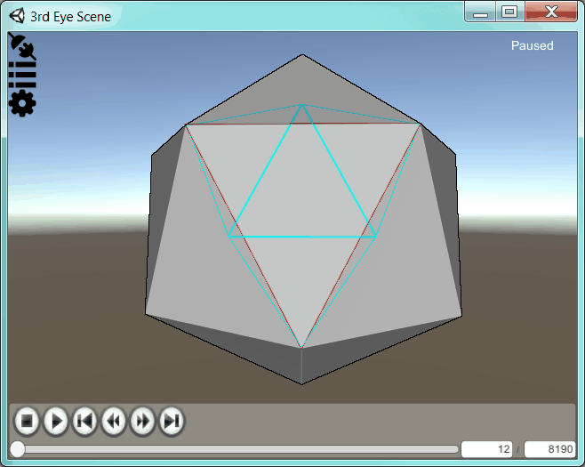
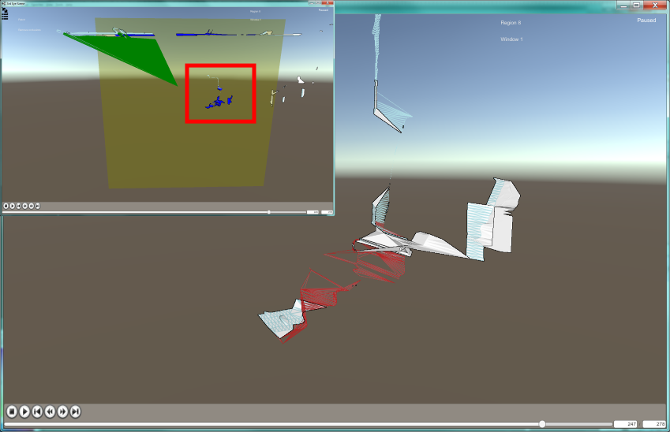
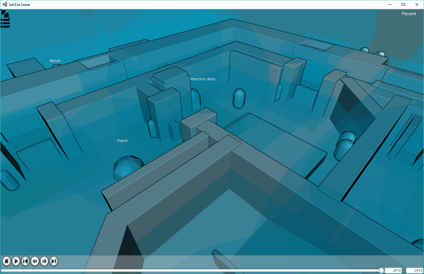

# Using 3rd Eye Scene server code {#docusage}

This page outlines how to use 3es server code to good effect either in debugging real time applications or opaque geometric algorithms.

The most important thing to remember about 3es is that it allows you to visualise data which would otherwise be opaque. 3es supports the software development tenant "make it visible". It is very difficult to debug something you cannot see. 3es server code essentially allows you insert render commands at arbitrary points in your code to remotely visualise, *record* and *playback* the result. Visualisation itself is not enough as things can happen too fast to see. 3es really shines when it is used to record and step through stepping through the playback to visualise what are otherwise single frame events.

## Example Use Cases

### Geometry processing visualisation

3rd Eye Scene can be used to debug and visualise geometry processing algorithms. The C++ example "3esSphereView" shows 3es being used to visualise the progressive tessellation of a sphere from an icosahedron. This is a non-real time algorithm, so the term "frame" is used to loosely describe a single step in the algorithm. Each frame outlines the face being considered in red and the tessellation to be effected in cyan. Once each face has been processed, the higher resolution sphere is shown before starting on the next iteration.

### Algorithm debugging usage case

This use case looks at a complex 3D collision and intersection algorithm. Part of the algorithm involves intersecting sets of tetrahedra against a triangle mesh. Due to the high numbers of elements involved, this code was ported to GPU from code previously validated on CPU. The initial GPU results did not agree with the CPU code, so 3rd Eye Scene was used to visualise the data set being operated on and the results. The image below shows one such frame from the recorded output.

In this frame we see the following elements:

- Existing triangles in white.
- Tetrahedra in green.
- Triangles used to generate the tetrahedra in cyan (wireframe).
- A transparent bounding box (green tint).
- The set of candidate triangles from the existing set highlighted in blue.

This frame immediately shows an issue with the bounding box used. The bounds should tightly fix the tetrahedra. However, The box clearly extents too far to the right and bottom of the image and not far enough to the left.

Next, we see an image of the supposedly intersected triangles, highlighted in red. The insert in the top left corder identifies where these triangles appear in the original image.

Clearly these triangles are nowhere near the tetrahedra and are not intersecting. The errant bounds is the primary clue and it was quickly discovered that vertex data was being accessed with the wrong stride, moving one floating point element per vertex rather than three per vertex. This issue was very quickly identified and solved as a direct consequence of using 3rd Eye Scene to record and visualise the output.

### Debugging Games

The 3rd Eye Scene viewer is built on Unity 3D, which is primarily a game engine. Most game logic and apparent behaviour relies heavily on "smoke and mirrors" thinking to give the user the illusion of a consistent world while maintaining high, real-time performance and low implementation cost. The physics world, for example, is invariably a coarse representation of the rendered geometry. Less geometry is much faster for physics calculations. AI is typically implemented using simple state machines and behaviour trees and it is not always immediately apparent what the AI is doing or why certain decisions are made. Visualisation of physics geometry and AI state is common practise during game development.

Note that proprietary physics viewers are commonly available with commercial physics viewer such as [Havok Physics](https://www.havok.com/physics/) and [PhysX](https://developer.nvidia.com/physx-sdk). Unity itself its own physics viewer in development. 3rd Eye Scene is not intended to compete with these tool as they are often tailored to exposing low level details only available deep in the internals of the physics engine. Instead, 3rd Eye Scene is inspired by such tools and can be used to expose game play and AI related information in a similar fashion.

Below is an image showing the physics geometry and AI state of the Unity [Angry Bots](https://www.assetstore.unity3d.com/en/#!/content/12175) sample.

By playing back the recording it becomes possible to see things which are not otherwise immediately apparent:

- Show AI state changes such as when becoming aware of the player.
- Visualise single frame events such as firing.
- Show AI timers.
