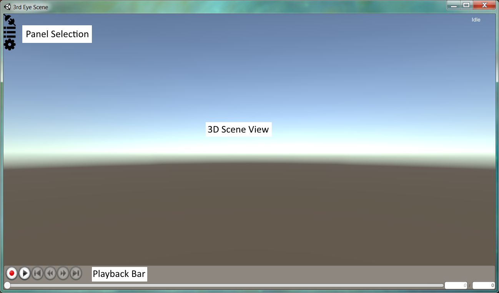
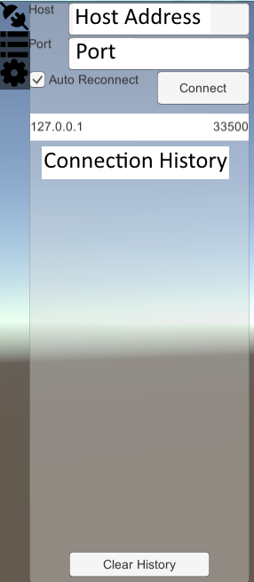
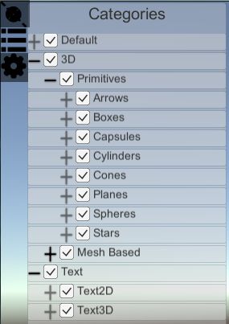

# 3rd Eye Scene viewer application {#docviewer}

> This describes the Unity C# viewer application. Details of the C++ Magnum Graphics viewer have yet to be documented, but the goal is to provide the same interface.

The 3rd Eye Scene Viewer application supports remote visualisation of 3es server commands. This section describes the basic UI and usage of the client application.

## Main UI

The viewer UI is a minimalist UI consisting of a 3D scene view, a playback bar and various panel buttons. The 3D scene view renders the current state of the currently connected server, or the current frame of a previously recorded session. The playback bar supports recording, playback, scrubbing and stepping frames. The panel buttons access additional UI components used to establish a connection or control viewer settings.

## Panel buttons

The panel buttons select the active UI panel. The current panels are listed below.

Button                        | Panel             | Purpose
----------------------------- | ----------------- | -------------------------------
       | Connection Panel  | Manage the current connection
 | Categories Panel  | Toggle active display categories
     | Settings Panel    | Access viewer settings

### Connection panel

The connection panel is used to establish a new connection, or to disconnect the current connection.

To establish a new connection;

1. Open the connection panel.
2. Enter the target host address and port.
3. Click "Connect"

The connection is made immediately if the server is already running. When the server is not yet running, use "Auto Reconnect" to keep trying to establish a connection, or reconnect so long as the viewer is running. Once connected, the "Connect" button changes to "Disconnect" and can be used to disconnect. The connection panel button also changes to reflect the status change.

Previous connections are listed in the Connection History. Each entry acts as a button. Simply click on the desired history item to attempt that connection again.

### Categories panel

The categories panel identifies all the object categories published by the server. Each category can be enabled or disabled by clicking the check box. Disabled categories do not appear in the 3D view. The categories are entirely server dependent.

### Settings panel

The settings panel i s used to edit the viewer settings. The panel itself shows the settings categories. Click on each item to edit settings relevant to that category. Settings are preserved between viewer sessions.

## Playback bar

The playback bar is mostly used during playback of a previously recorded session. It is also used to initiate recording of the current session.

Button                            | Purpose
--------------------------------- | --------------------------------------------------------------
             | Start recording of the current session. Changes to "Stop".
                 | Stop current recording or playback.
                 | Start/resume playback of a recorded file. Changes to "Pause".
               | Pause playback. Enabled frame stepping.
  | Skip to the start of playback.
   | Step back one frame (while paused)
 | Step forwards one frame (while paused)
     | Skip to the end of playback.

To start recording, click the record button. This opens the file dialog. From here select the file to record to. Recording begins immediately if already connected, or as soon as a connection is established.

To playback a previously recorded file, disconnect if connected, then press play. This opens the file dialog. Browse to the recorded file and select open. Playback begins paused.

During playback, the step and skip buttons can be used to step single frames, or to either end of the recording. These buttons only function while paused. The timeline can also be used to scrub to a desired frame. Finally, the current frame number can be edited to select a desired frame number.
